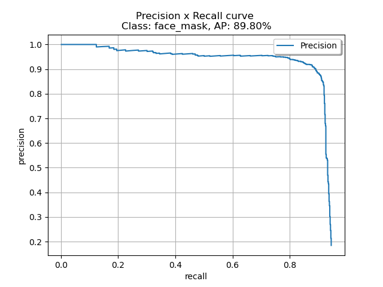

# COVID 19 Mask Detection

## Important Note

There was a discrepancy in the dataset. In a few cases, people wearing masks improperly (hanging around the neck, not covering the nose, not covering the mouth) were labelled as **face_mask** and in other cases they were labelled as **face**.

For this project, I took the liberty to assume that **any person not wearing a mask properly will be classified as `face` and NOT `face_mask`**.

For high accuracy, set `resize` to 1 while calling `run.py`. For high mAP, set `thresh` to 0.5.

## Included Files

The following files must be executed in order with your custom paths if the model needs to be trained on a new dataset:

* **data_prep.py**: Python file to read XML annotations and return a dictionary of `filename: [bboxes, cats]`

* **face-cropper.ipynb**: Take in the annotations from data_prep and crop & separate the train-val images into approopriate categories. Creates `cropped/face_FULL cropped/face_mask` directories for both train and val datasets. The annotations are expanded by a scale of 1.5 to include more image features.

* **blurfile-nullfile-removal.ipynb**: Removes the blurred face annotations and helps in dataset balancing.

* **classifier.ipynb**: Trains a classifier on the prepared dataset.

* **weights diirectory**: Contains trained PyTorch models (.pth files), pretrained imagenet mobilenet model (tar file) and a pkl file that stores the learner weights, normalization parameters, etc. Loading the pkl file in FastAI creates an inference learner with an empty databunch.  

* **run.py**: File to run inference on a custom test folder. 

* **evaluate**: Helper files from [Object Detection Metrics](https://github.com/rafaelpadilla/Object-Detection-Metrics) to evaluate the mAP of the combined pipeline.

* Helper files from the [PyTorch port of RetinaFace Model]((https://github.com/biubug6/Pytorch_Retinaface)).

## Solution Approach

According to the needs, the solution would be judged on three different metrics:

* Detection Accuracy
* Classification Accuracy
* Speed / Accuracy Tradeoff

Hence, I propose a two-stage pipeline model.

### Detection Phase

I employed a RetinaFace model, with MobileNet0.25 as the backbone. The model was obtained from [here](https://github.com/biubug6/Pytorch_Retinaface). The reason is that the model has only 1.7M parameters, when RetinaFace uses MobileNet0.25 as backbone net. The model achieves state of the art accuracy on WiderFACE dataset. The model was finetuned on our particular dataset to include people with masks.

### Classification Phase

To yield high accuracy, I trained a ResNet-34 classifier after extracting the face crops from the dataset.

## Exploratory Data Analysis

### Imbalanced Data

There is no point in optimizing any metrics if the data is not quite right. Since the data is scraped from the internet, it was bound to have errors. My first goal was to find these errors and prepare a clean dataset.

The first observation made was that the annotations were highly disbalanced. 

| Face Count | Mask Count |
|:----------:|:----------:|
|    7300    |    2222    |

On further analysis, it was noted that too many of the face annotations are extremely blurry.

So, I decided to [detect blurs](https://www.pyimagesearch.com/2015/09/07/blur-detection-with-opencv/) in images and remove the most blurred images to keep only 3333 (1.5 x 2222) images as the train set. This allows the network to train much more stably and enables it to perform much better in the real world.

Cleaned Counts:

| Face Count | Mask Count |
|:----------:|:----------:|
|    3333    |    2222    |

### The Unfixable Problem of Mislabelled Data

The dataset had a HUGE amount of mislabelled annotations. I employed a clever way to fix these annotations. 

* First of all, I trained a classifier on the dataset.
* After reasonable amount of training, I printed out the images that my model got "most wrong", as shown in the image. 
* Then I followed on to the images IDs and replaced them with the correct labels.

## Training Phase

The model was trained using the FastAI Library which builds Pytorch Models. 

### One Cycle Learning

The learning rate is the most important parameter to set while training a network. In the paper [“A disciplined approach to neural network hyper-parameters: Part 1 — learning rate, batch size, momentum, and weight decay”](https://arxiv.org/abs/1803.09820) , Leslie Smith describes approach to set hyper-parameters (namely learning rate, momentum and weight decay) and batch size. In particular, he suggests 1 Cycle policy to apply learning rates. 

This method was followed to train the model, using a weight decay for regularization. 

### Progressize Size Increment

Another interesting thing done to temper the model well to the dataset at hand, was to use data tempering, as described by Jeremy Howard.

Because of the Adaptive Average Pooling layers, network these days can take variable sized inputs. We capitalize on this fact to temper the network at (128 x 128) images. As soon as the network starts to overfit, the full training image size of (224 x 224) was used. This helped to reduce overfitting and create an almost-perfect classifier with the available dataset. 

## Results and Inferences:

### mAP Achieved

A near state of the art mAP of **90.28** was achieved on the final cleaned dataset.

| Face AP | Mask AP |
|:----------:|:----------:|
|     90.76%   |    89.80%    |

Precision-Recall Curves are as follows:

### Classification Accuracy

An accuracy of **97.9622%** was achieved on the provided validation set. Some sample results from the model are included in the output and samples folder. 

### Inference Speed

The inference was carried out on the CPU. Stats:

i7-7700HQ CPU @ 2.80Ghz

* IMAGE DETECTION TIMES:			[forward_pass_time: 0.1840s misc: 0.0225s] per image

* IMAGE CLASSIFICATION TIMES:		[forward_pass_time: 0.1840s misc: 0.0225s] per image

The model was trained on a GTX 1060 with 6GB VRAM. One epoch took around 2 minutes to train.

### Sample Result

[Image souce](https://www.telegraph.co.uk/global-health/science-and-disease/need-powerful-people-movement-support-wearing-face-masks-uk/). A completely unseen image. 

## Acknowledgements & Citations

* [Object Detection Metrics](https://github.com/rafaelpadilla/Object-Detection-Metrics)

* [PyTorch port of RetinaFace Model](https://github.com/biubug6/Pytorch_Retinaface)

* [Blur Detection](https://www.pyimagesearch.com/2015/09/07/blur-detection-with-opencv/)